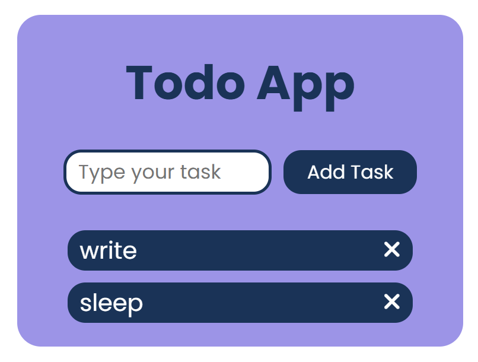

# 📝 To-Do List

A simple and responsive To-Do List app built using **HTML**, **CSS**, and **JavaScript**.  
This project helps users manage daily tasks with ease by adding and deleting them in real-time.

---

## 🚀 Features

- ✅ Add & remove tasks dynamically
- 🎨 Clean and minimal UI
- 📱 Fully responsive design
- ⚡ Built using only HTML, CSS, and JavaScript

---

## 📸 Screenshot

---

## 🌐 Live Demo

🔗 [Click here to try it out](https://mayank-todo-list.netlify.app/)  

---

## 👨‍💻 Author

**Mayank Kamble**  
[GitHub](https://github.com/CoderMak25)

---

## 📄 License

This project is licensed under the [MIT License](./LICENSE).
